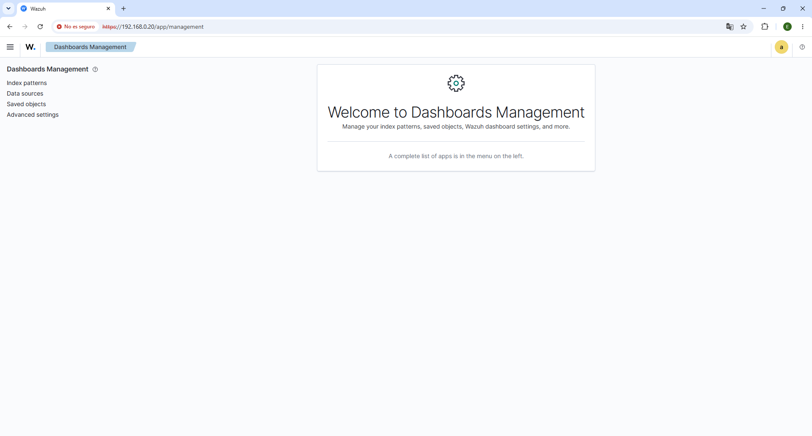
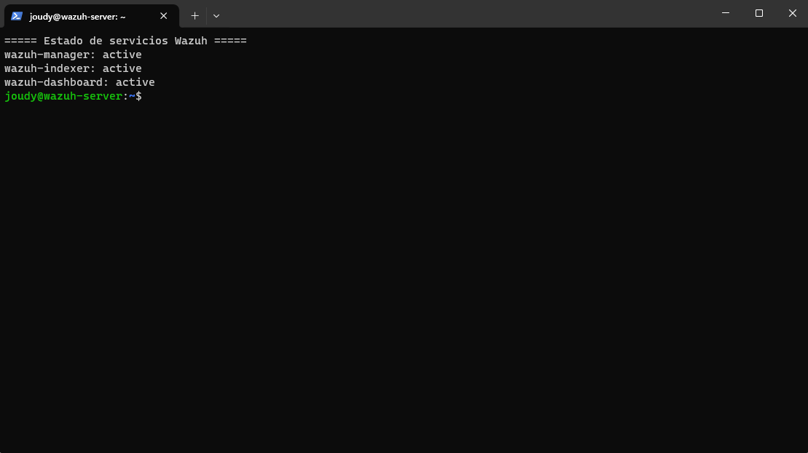
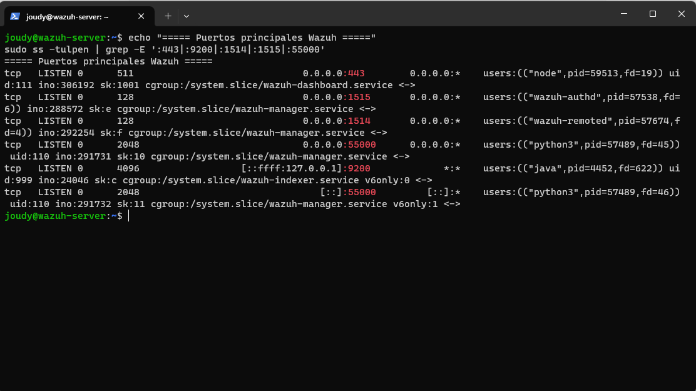
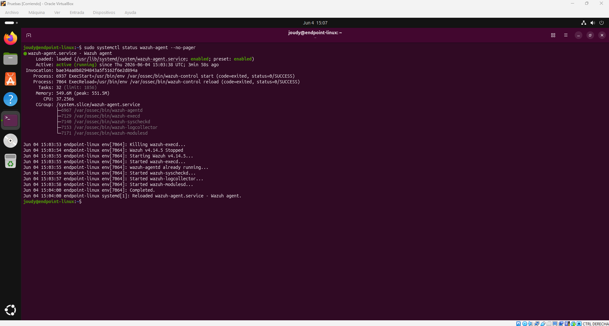
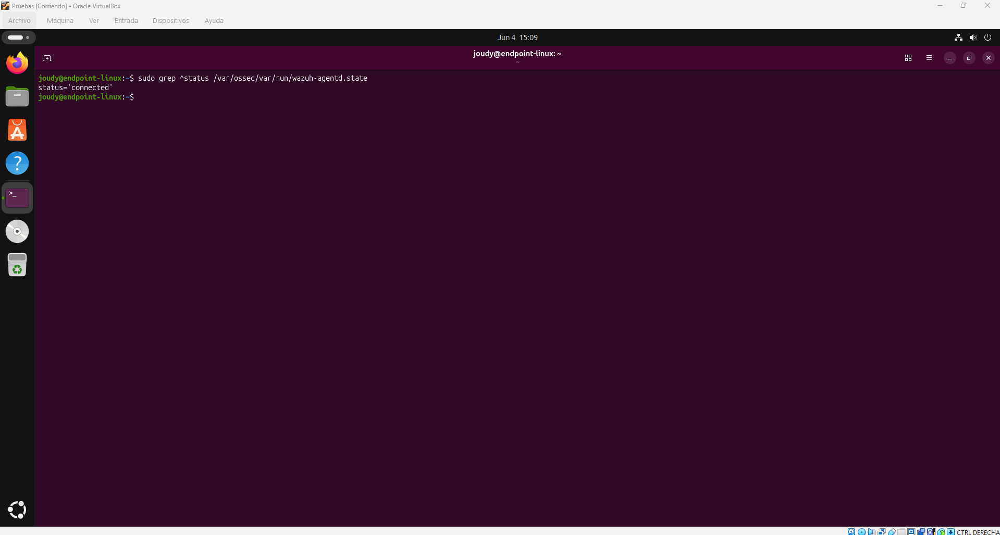
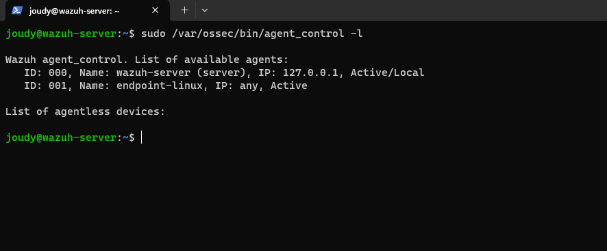
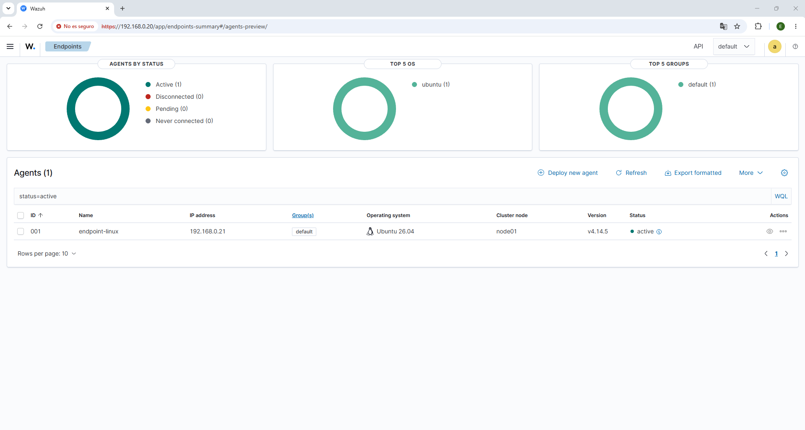

# 01 - Laboratorio SOC con Wazuh

## Estado del proyecto

Fase 2 completada: instalación inicial de Wazuh, validación de servicios, comprobación de puertos principales, acceso al dashboard y alta de un agente Linux monitorizado.

---

## Objetivo

El objetivo de este proyecto es montar un laboratorio básico de ciberseguridad defensiva orientado a tareas de un analista SOC N1.

Se utiliza Wazuh como plataforma SIEM/XDR para recoger eventos de seguridad, revisar alertas, analizar logs y documentar evidencias generadas en un entorno de laboratorio.

---

## Alcance inicial

Este laboratorio se realiza en un entorno controlado y no utiliza información real de empresas, clientes o terceros.

El proyecto incluye:

* Instalación de Wazuh en Linux.
* Acceso al Wazuh Dashboard.
* Revisión de servicios instalados.
* Validación de puertos principales.
* Alta de agentes monitorizados.
* Generación controlada de eventos.
* Análisis básico de alertas.
* Documentación de evidencias y conclusiones.

---

## Entorno utilizado

| Equipo           | Sistema operativo       | Rol                                              |
| ---------------- | ----------------------- | ------------------------------------------------ |
| Wazuh Server     | Ubuntu Server 24.04 LTS | Servidor Wazuh                                   |
| Equipo anfitrión | Windows                 | Acceso al dashboard y administración por SSH     |
| Endpoint Linux   | Ubuntu 26.04 LTS        | Equipo monitorizado mediante agente Wazuh        |
| Endpoint Windows | Windows 10/11           | Equipo monitorizado, fase posterior              |
| Kali Linux       | Kali Linux              | Generación controlada de eventos, fase posterior |

---

## Herramientas utilizadas

* Wazuh
* Ubuntu Server
* Ubuntu Desktop
* Windows
* PowerShell
* SSH
* GitHub

---

## Preparación de la máquina virtual

Para el laboratorio se creó una máquina virtual dedicada exclusivamente al servidor Wazuh.

Configuración utilizada:

| Recurso                   | Valor                   |
| ------------------------- | ----------------------- |
| Sistema operativo         | Ubuntu Server 24.04 LTS |
| Hostname                  | wazuh-server            |
| Usuario de administración | joudy                   |
| CPU                       | 4 vCPU                  |
| Memoria RAM               | 8 GB                    |
| Disco                     | 80 GB                   |
| Dirección IP              | 192.168.0.20            |
| Red                       | Adaptador puente        |

La máquina virtual se desplegó en una red local de laboratorio, permitiendo el acceso al dashboard de Wazuh desde el equipo anfitrión mediante navegador web.

---

## Instalación de Wazuh

Se realizó una instalación all-in-one de Wazuh sobre Ubuntu Server. Este tipo de instalación despliega los componentes principales en el mismo servidor, lo que resulta adecuado para un entorno de laboratorio.

Componentes instalados:

* Wazuh Manager
* Wazuh Indexer
* Wazuh Dashboard
* Filebeat
* Certificados internos para la comunicación entre componentes

Comandos principales utilizados:

```bash
sudo apt update
sudo apt install curl -y

curl -sO https://packages.wazuh.com/4.14/wazuh-install.sh
sudo bash ./wazuh-install.sh -a
```

Durante la instalación, el asistente generó las credenciales iniciales de acceso al dashboard.

Por seguridad, las credenciales no se documentan en este repositorio.

---

## Validación de servicios

Tras finalizar la instalación se comprobó el estado de los servicios principales:

```bash
sudo systemctl status wazuh-manager --no-pager
sudo systemctl status wazuh-indexer --no-pager
sudo systemctl status wazuh-dashboard --no-pager
```

Resultado obtenido:

| Servicio        | Estado           |
| --------------- | ---------------- |
| wazuh-manager   | active (running) |
| wazuh-indexer   | active (running) |
| wazuh-dashboard | active (running) |

Esto confirma que los componentes principales de Wazuh se encuentran iniciados correctamente.

---

## Validación de puertos

También se revisaron los puertos principales utilizados por Wazuh:

```bash
sudo ss -tulpen | grep -E ':443|:9200|:1514|:1515|:55000'
```

Resultado validado:

| Puerto | Servicio        | Función                            |
| ------ | --------------- | ---------------------------------- |
| 443    | Wazuh Dashboard | Acceso web HTTPS al panel de Wazuh |
| 1514   | Wazuh Remoted   | Comunicación de agentes            |
| 1515   | Wazuh Authd     | Registro de agentes                |
| 55000  | Wazuh API       | API de administración              |
| 9200   | Wazuh Indexer   | Indexación y búsqueda interna      |

El dashboard quedó accesible desde el navegador del equipo anfitrión mediante:

```text
https://192.168.0.20
```

---

## Acceso al dashboard

Se verificó el acceso correcto al Wazuh Dashboard desde el navegador del equipo anfitrión.

El navegador mostró un aviso de certificado no confiable, comportamiento esperado en un laboratorio al utilizar certificados autofirmados.

Una vez aceptado el aviso, se accedió correctamente al panel web de Wazuh.

---

## Alta de agente Linux

Se añadió un endpoint Linux al laboratorio para ser monitorizado por Wazuh.

Configuración del agente:

| Parámetro               | Valor            |
| ----------------------- | ---------------- |
| Hostname                | endpoint-linux   |
| Sistema operativo       | Ubuntu 26.04 LTS |
| IP del agente           | 192.168.0.21     |
| Wazuh Manager           | 192.168.0.20     |
| Estado del servicio     | active (running) |
| Estado de conexión      | connected        |
| Estado en Wazuh Manager | Active           |

Antes de instalar el agente, se configuró la red de la máquina virtual en modo adaptador puente para permitir la comunicación directa con el servidor Wazuh.

Se validó la conectividad entre el endpoint Linux y el servidor Wazuh mediante `ping`:

```bash
ping -c 4 192.168.0.20
```

Posteriormente, se instaló el agente Wazuh en el endpoint Linux, configurándolo para comunicarse con el Wazuh Manager ubicado en `192.168.0.20`.

Comandos principales utilizados para la instalación:

```bash
curl -s https://packages.wazuh.com/key/GPG-KEY-WAZUH | sudo gpg --no-default-keyring --keyring gnupg-ring:/usr/share/keyrings/wazuh.gpg --import
sudo chmod 644 /usr/share/keyrings/wazuh.gpg

echo "deb [signed-by=/usr/share/keyrings/wazuh.gpg] https://packages.wazuh.com/4.x/apt/ stable main" | sudo tee /etc/apt/sources.list.d/wazuh.list
sudo apt update

sudo WAZUH_MANAGER="192.168.0.20" apt install wazuh-agent -y
```

Tras instalar el paquete `wazuh-agent`, se habilitó el servicio para arrancar automáticamente con el sistema y se inició manualmente:

```bash
sudo systemctl daemon-reload
sudo systemctl enable wazuh-agent
sudo systemctl start wazuh-agent
sudo systemctl status wazuh-agent --no-pager
```

Comandos de validación utilizados:

```bash
sudo grep ^status /var/ossec/var/run/wazuh-agentd.state
sudo /var/ossec/bin/agent_control -l
```

Resultado obtenido:

* El servicio `wazuh-agent` quedó en estado `active (running)`.
* El agente mostró estado `connected`.
* El Wazuh Manager mostró el agente `endpoint-linux` como `Active`.

Esto confirma que el endpoint Linux quedó correctamente conectado al servidor Wazuh y preparado para enviar eventos de seguridad al manager.

---

## Evidencias

Las evidencias visuales del proyecto se almacenan en la carpeta `capturas`.

### Acceso al Wazuh Dashboard



[Ver captura del dashboard](./capturas/01-dashboard-wazuh.png)

### Servicios principales activos



[Ver captura de servicios activos](./capturas/02-servicios-activos.png)

### Puertos principales de Wazuh



[Ver captura de puertos principales](./capturas/03-puertos-wazuh.png)

### Servicio del agente Linux activo



[Ver captura del servicio del agente Linux](./capturas/04-agente-linux-servicio-activo.png)

### Estado de conexión del agente Linux



[Ver captura del estado connected](./capturas/05-agente-linux-connected.png)

### Agente Linux visible desde Wazuh Manager



[Ver captura de agent_control](./capturas/06-agente-linux-agent-control.png)

### Agente Linux activo en el dashboard



[Ver captura del agente en dashboard](./capturas/07-agente-linux-dashboard.png)

---

## Criterio de análisis

Para cada alerta o evento se documentará:

* Qué se observa.
* Qué equipo está afectado.
* Qué usuario o IP interviene.
* Qué riesgo podría existir.
* Qué evidencias apoyan el análisis.
* Qué no se puede confirmar todavía.
* Qué siguientes pasos se recomiendan.

---

## Próximos pasos

* Añadir un agente Windows.
* Generar eventos controlados desde el endpoint Linux.
* Generar eventos controlados desde un endpoint Windows.
* Analizar las primeras alertas desde el punto de vista de un analista SOC N1.
* Documentar evidencias adicionales del laboratorio.
* Relacionar alertas relevantes con técnicas de MITRE ATT&CK cuando proceda.

---

## Conclusión de la fase

La instalación inicial de Wazuh se completó correctamente.

Se validó que:

* El servidor Wazuh está operativo.
* Los servicios principales están activos.
* Los puertos necesarios están escuchando.
* El dashboard es accesible desde el equipo anfitrión.
* El agente Linux `endpoint-linux` está instalado, activo y conectado al Wazuh Manager.
* El entorno queda preparado para añadir agentes adicionales y generar eventos controlados.
